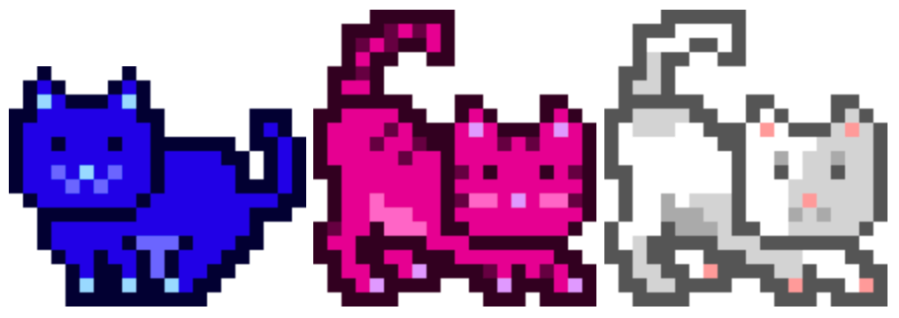

# CAT-21 Protocol Specification

## Overview

CAT-21 is a new protocol developed to operate on top of the Bitcoin blockchain and leverages the Ordinals concept.
It introduces a unique way of representing and transacting digital assets, specifically pixelated cat images, in a decentralized manner.
CAT-21 transactions are identified using the `nLockTime` field in a Bitcoin transaction, with a specific focus on the value `21`.

## Protocol Rules

### Identification of a CAT-21 Mint Transaction

1. **nLockTime Value**: A transaction is considered a CAT-21 mint if its [`nLockTime`](https://en.bitcoin.it/wiki/NLockTime) value is set to `21`.
2. **Transaction Type**: A CAT-21 mint transaction must be a payment to a pay-to-taproot (P2TR) address (which starts with `bc1p`).
3. **First Output Matters**: For a mint transaction, only the first output is important. It defines the recipient of the CAT-21 mint. All other inputs and outputs are ignored. Therefore, every Bitcoin transaction can create exactly one cat.
4. **Ownership**: The ownership of a CAT-21 asset is determined by the entity controlling the first Satoshi in the transaction output, in line with the [Ordinal Theory](https://docs.ordinals.com/overview.html).
5. **Image Association**: Each CAT-21 asset is intrinsically linked to an image.
  This image is generated based on the transaction ID of the mint transaction, creating a unique pixelated cat image.

### Transferring CAT-21 assets

1. CAT-21 can be transferred using standard Bitcoin transactions.
2. The new owner of a CAT-21 asset is the entity controlling the first Satoshi of the mint transaction output.
   This is the same concept that applies to Ordinals and Inscriptions – but for digital cat artifacts!

### Immutability

1. Digital CAT-21 assets can't be destroyed, they are immutable on the Bitcoin blockchain.
2. If a CAT-21 asset is sent to a "burner" address, the cat still exists but no longer has an owner. (The cat is free!)

## Library and Tools

### Image Representation

Each CAT-21 asset is intrinsically linked to a generated image. 
The creation of generative cat art is a fundamental part of this protocol. 
We must choose a free, open-source library that will render the required cat images.

* **Format**: The images will be generated in a standard web-friendly format (e.g., PNG).
* **Dimensions**: The dimensions of the generated images will be consistent across all CAT-21 assets.
* **Storage**: Images are not stored on the blockchain but are generated on-demand using the transaction ID as a seed.

### Locating CAT-21 Mint Transactions

Existing CAT-21 Mint Transactions can be easily searched using Blockchair's search functionality.
The following links provide pre-configured queries according to CAT-21 protocol rules:

1. [Query for Mainnet](https://blockchair.com/bitcoin/transactions?q=lock_time(21)#f=hash,block_id,input_count,output_count,time,lock_time)
2. [Query for Testnet](https://blockchair.com/bitcoin/testnet/transactions?q=lock_time(21)#f=hash,block_id,input_count,output_count,time,lock_time) 

These queries are designed to filter transactions based the `nLockTime` set to `21`.
However, it's important to note that the queries do not filter based on transaction type. As per the CAT-21 protocol, a valid CAT-21 mint transaction must be a payment to a pay-to-taproot (P2TR) address.

### CAT-21 Ecosystem

* A library will be developed to facilitate the generation of cat images based on transaction IDs.
* Tools for verifying and displaying CAT-21 assets will be made available.
* CAT-21 Mint Transactions will be displayed on https://ordpool.space 

## Future Development

### Open Discussion

The protocol may be expanded to include additional features based on community feedback and technological advancements.
Please make a pull request to the [cat-21 repository](https://github.com/haushoppe/cat-21) to participate in the open development.

The CAT-21 protocol introduces a novel way of digital asset representation and transaction on the Bitcoin blockchain, inviting marketplaces, wallets, and indexers to adopt and integrate this disruptive protocol in the broader ecosystem!

### Roadmap

1. Development of a sound Protocol Specification (this document)
2. Reference implementation in the [ordpool-parser repository](https://github.com/haushoppe/ordpool-parser) (the engine that parses digital artifacts on ordpool.space)
3. Development of a simple script (TypeScript preferred) that creates a PSBT to mint a CAT-21 asset
4. Open invitation of the Ordinals ecosystem to adapt the protocol in their products!

## Idea and concept

The idea for this protocol came from this [twitter conversation](https://twitter.com/HausHoppe/status/1741789980551213207).
[@1440000bytes](https://twitter.com/1440000bytes) had the initial idea to use the `nLockTime` field for data storage.
[@HausHoppe](https://twitter.com/HausHoppe) adapted the idea and created this repository to engage collaboration and discussions on the protocol.
